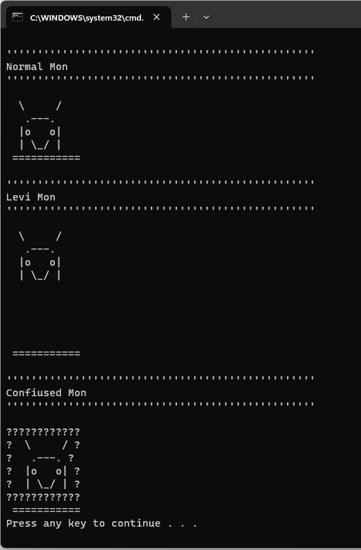

# Lab 2: Inheritance & Polymorphism

In this lab you'll practice working with inheritance and polymorphism. Through creating different types of a game element 'Monster'. 
The game contains 3 types of monsters, a normal monster, a confused monster and a levitated monster.
The normal monster is defined in the given class Monster which defines the basic behavior of all the monsters.
The levitated monster is just a normal monster that's levitated by a given height. 
The confused monster is just also a normal monster that's surrounded by question marks.

- Create classes to represent the LevitatedMonster and the ConfustedMonster that inherit from the given Monster class.
- Use polymorphism to implement the proper drawing of the monster type without duplicating the code.
- To draw the confused monster you'll need to change the behaviour of the DrawMonster method, please do so without affecting the way it was called in the starter code 
(i.e. line 8 in Monster.cs should not be affected by the change you'll introduce and the normal monster should be drawn as expected before the change)
- Use polymorphism to override the ToString method so that it would print the header as shown in the screenshot.
- Please don't change the code in the Main method.

## Note regarding the submission
- Make sure to push your solution to the GitHub repo for grading 
